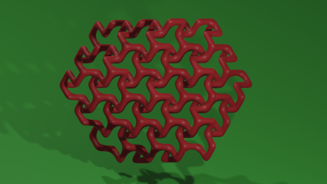
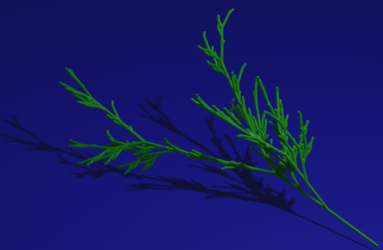
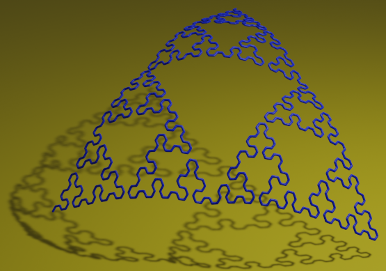
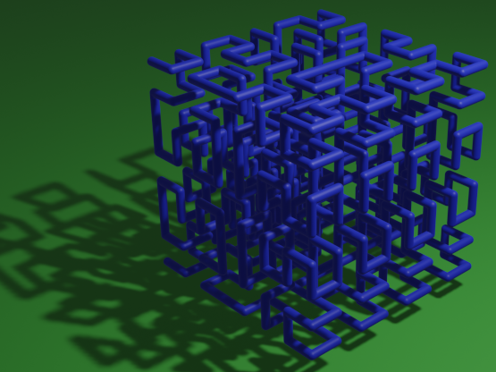
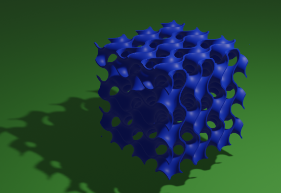
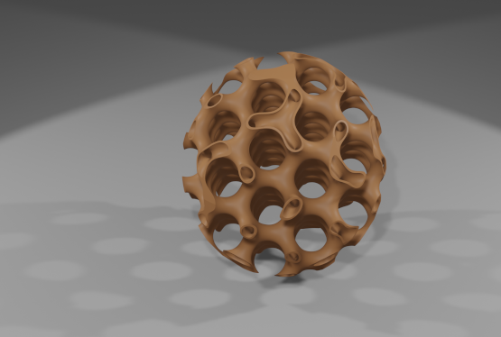

[](https://crates.io/crates/toxicblend)
[](https://github.com/eadf/toxicblend.rs/workflows/Rust/badge.svg)
[](https://github.com/eadf/toxicblend.rs/workflows/Clippy/badge.svg)
[](https://deps.rs/crate/toxicblend/0.0.19)


It is a [client-server](https://grpc.io) based addon for [Blender](https://www.blender.org/) written in Rust (and Python for the client side parts).  

## Blender addon installation
Follow instructions in [install_as_blender_addon.md](blender_addon/install_as_blender_addon.md)

## Rust requirement
Rust 1.56+

Will automatically make use of the fast(er) features `hash_drain_filter` and `map_first_last` if run on `rust +nightly`

## Run local server
A blender addon based on a client-server model using [grpc](https://grpc.io) and [tonic](https://github.com/hyperium/tonic).
The blender addon is the client, and it only connects to `localhost`.
The server binds to `localhost` as well; so it should not be reachable from any other computer (not thoroughly tested), run it with this command:
```
cargo +nightly run --bin toxicblend_server --release
```

or just 
```
cargo run --release
```

### Saft backend
You can enable the [saft](https://crates.io/crates/saft) voxel meshing backend like this:
```
cargo +nightly run --release --features saft
```

## Run blender
If the grpc server (for any unimaginable reason) would crash, blender will hang waiting for response.
This can easily be fixed if you run blender from the console. A `ctrl` - `C` will fix it.

## Development status
Project is still in development, I will add more operations. The existing operations are pretty much usable as-is.

## Addon operations:

These operations all operate in blender edit mode:

### Operation: 2d outline

Will convert a flat mesh object into a 2D outline. Right now the data must be in a plane crossing origin (one axis need to be zero)


### Operation: Simplify

Works similarly to the built-in simplify command, but instead of a distance it takes a percentage.
This percentage is applied to the largest dimension of the AABB and that value is used as the Ramer–Douglas–Peucker distance.
Works on 3D linestrings/polylines (no faces).


This percentage change makes it possible to simplify tiny objects without having to scale them up, simplify and then scale them down again.

### Operation: Voronoi mesh
Runs the Voronoi sweep-line algorithm on loops of 2D lines and builds a 2½D mesh (input geometry must be on a plane crossing origin).

Note: Edges may *only* intersect at their end points, use the `Knife intersect` operation to make it so.


### Operation: Centerline

Takes the output of the 2d_outline command and calculates the 3D centerline.

This operation only works on non-intersecting loops with islands of loops inside. E.g. fonts.

If you only need the 2D centerline, you can simply scale the added dimension to zero.

Keyboard command: `s` `z` `0` for setting Z to zero.


### Operation: Voronoi
Runs the Voronoi sweep-line algorithm on 2D points and lines (geometry must be on a plane crossing origin).


### Operation: Voxel


Takes an edge-only 3D mesh, like the output of the Voronoi operation, and puts voxelized tubes along the edges.
This operation does *not* require flat input.

This operation uses [fast-surface-nets](https://crates.io/crates/fast-surface-nets) or [saft](https://crates.io/crates/saft) for voxel generation.

### Operation: Metavolume (object operation)
Takes an edge-only mesh, like the output of the Voronoi operation, and puts metaballs along the edges.
This operation does *not* require flat input.

This operation is located under `Object` -> `Add` -> `Metaball` -> `MetaVolume`


### Operation: LSystems (object operation)
Generates parametric Lindenmayer systems 3d graph/curves. 
This operation is located under `Object` -> `Add` -> `Mesh` -> `LSystem`











### Operation: Gyroid (object operation)
Generates a parametric Gyroid



Gyroid intersected with an egg-shape:



### Operation: Knife intersect

Runs on a single flat wire-frame object made of edges (no faces) and tests for self-intersections.
If an intersection is found, the intersecting edges will be split at that point.

### Operation: Select end vertices

Selects all wire-frame vertices that only connects to one other vertex. Useful for identifying dangling vertices.

### Operation:Select vertices until intersection

Selects all (wire-frame) vertices that are connected to already selected vertices. 
It continues doing this until an intersection is detected.
Could be useful for deleting strings of vertices generated by 'Knife intersect'

### Operation: Select collinear edges

Select edges that are connected to the selected edges, but limit by an angle constraint.
If edge `A` is selected and edge `B` is directly connected to it, `B` will be selected if the angle between `A` and `B` 
is smaller than the angle limit. `B` will then be used to select more edges and so on.

### Operation: Select intersection vertices

Selects all vertices that connects to three or more other vertices. Useful for selecting intersections.

### Operation: Debug object

Checks a mesh for anomalies, double edges etc. Will print results to the console/terminal.

## Todo

- [ ] Add command line options to the server, setting bind address and port. Possibly feature gated for security reasons.
- [ ] Port the rest of the operations.
- [ ] Lift the 'flatness' restriction, it should be enough with flat in any plane.
- [ ] Create docker release image
- [ ] When everything has stabilized, remove the gRPC layer and publish as a Python package using the Rust binaries directly.  

## Changelog:
### 0.0.19
- saft 0.24
- tonic 0.6
- prost 0.9
- smallvec 1.7
### 0.0.18 
- Replaced [building_blocks](https://crates.io/crates/building_blocks) with [fast_surface_nets](https://crates.io/crates/fast_surface_nets)
- Refactoring of Lindenmayer Systems
- Made sure there is one empty voxel surrounding geometry
- Rust 1.56.0 and 2021 Edition
- Dependency updates
### 0.0.17 (GitHub release)
- Added [fast_surface_nets](https://crates.io/crates/fast_surface_nets) & [saft](https://crates.io/crates/saft)
- Replaced [yabf](https://crates.io/crates/yabf) with [vob](https://crates.io/crates/vob)
### 0.0.16 (GitHub release)
- Updated [building_blocks](https://crates.io/crates/building_blocks) to 0.8.0 (GitHub snapshot)
