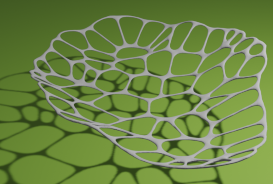
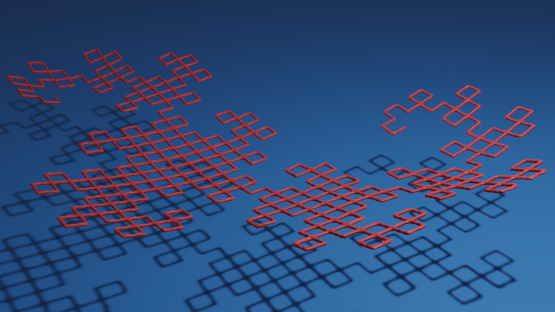

[](https://crates.io/crates/toxicblend)
[](https://github.com/eadf/toxicblend.rs/workflows/Rust/badge.svg)
[](https://github.com/eadf/toxicblend.rs/workflows/Clippy/badge.svg)
[](https://deps.rs/crate/toxicblend/0.0.6)


Work in progress.\
This will be a rust port of my old scala based project [toxicblend.](https://github.com/toxicblend/toxicblend) (now defunct)

It is a [client-server](https://grpc.io) based addon for [Blender](blender.org) written in Rust (and Python for the client side parts).  

## Blender addon installation
Follow instructions in [install_as_blender_addon.md](blender_addon/install_as_blender_addon.md)

## Rust requirement

Requires `#![feature(hash_drain_filter)]` and `#![feature(map_first_last)]` i.e. `rust +nightly`

## Run local server
The blender addon is based on a client-server model using [grpc](https://grpc.io) and [tonic](https://github.com/hyperium/tonic).
The blender addon is the client, and it only connects to `localhost`.
The server binds to `localhost` as well; so it should not be reachable from any other computer (not thoroughly tested), run it with this command:
```
cargo +nightly run --bin toxicblend_server --release
```

## Run blender
If the grpc server (for any unimaginable reason) would crash, blender will hang waiting for response.
This can easily be fixed if you run blender from the console. A `ctrl` - `C` will fix it.

## Addon operations:

These operations all operate in blender edit mode:

### operation: 2d outline

Will convert a flat mesh object into a 2D outline. Right now the data must be in a plane crossing origin (one axis need to be zero)


### operation: Simplify

Works similarly to the built-in simplify command, but instead of a distance it takes a percentage.
This percentage is applied to the largest dimension of the AABB and that value is used as the Ramer–Douglas–Peucker distance.
Works on 3D linestrings/polylines (no faces).


This percentage change makes it possible to simplify tiny objects without having to scale them up, simplify and then scale them down again.

### operation: Voronoi mesh
Runs the Voronoi sweepline algorithm on loops of 2D lines and builds a 2½D mesh (input geometry must be on a plane crossing origin).

Encircle the input lines in an outer, closed, perimeter for better results.

Do *not* input single points or faces, only edge loops.


### operation: Centerline

Takes the output of the 2d_outline command and calculates the 3D centerline.

This operation only works on non-intersecting loops with islands of loops inside. E.g. fonts.

If you only need the 2D centerline, you can simply scale the added dimension to zero.

Keyboard command: `s` `z` `0` for setting Z to zero.


### operation: Voronoi
Runs the Voronoi sweepline algorithm on 2D points and lines (geometry must be on a plane crossing origin).


### operation: Voxel



Takes an edge-only 3D mesh, like the output of the Voronoi operation, and puts voxelized tubes along the edges.
This operation does *not* require flat input.

This operation uses [building-blocks](https://crates.io/crates/building-blocks) and [sdfu](https://crates.io/crates/sdfu) for the voxel generation.

### operation: Metavolume (object operation)
Takes an edge-only mesh, like the output of the Voronoi operation, and puts metaballs along the edges.
This operation does *not* require flat input.

This operation is located under `Object` -> `Add` -> `Metaball` -> `MetaVolume`


### operation: LSystems (object operation)
Generates a Lindenmayer systems graph/curve using [dcc-lsystem](https://github.com/dcchut/dcc-lsystem).

This operation is located under `Object` -> `Add` -> `Mesh` -> `LSystem`




### operation: Knife intersect

Runs on a single flat mesh object made of edges (no faces) and tests for self-intersections.
If an intersection is found, the intersecting edges will be split at that point.

### operation: Select end vertices

Selects all vertexes that only connects to one other vertex. Useful for identifying dangling vertices.

### operation: Select collinear edges

Select edges that are connected to the selected edges, but limit by an angle constraint.
If edge `A` is selected and edge `B` is directly connected to it, `B` will be selected if the angle between `A` and `B` 
is smaller than the angle limit. `B` will then be used to select more edges and so on.

### operation: Select intersection vertices

Selects all vertexes that connects to three or more other vertices. Useful for selecting intersections.

### operation: Debug object

Checks a mesh for anomalies, double edges etc. Will print results to the console/terminal.

## Todo

- [X] Improve the addon installation process, put the site-package files in a separate pip package.
- [X] Document the rest of the operations.
- [ ] Add command line options to the server, setting bind address and port. Possibly feature gated for security reasons.
- [ ] Port the rest of the operations.
- [ ] Lift the 'flatness' restriction, it should be enough with flat in any plane.
- [ ] completely replace fnv
- [ ] make the gRPC protocol much more efficient, support f32 and packed triangles 
- [ ] voronoi mesh generates some faulty faces 

