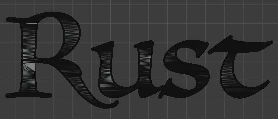
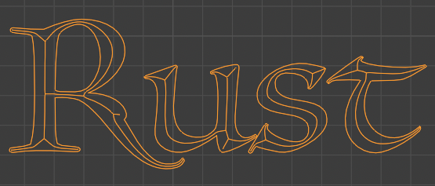

[](https://crates.io/crates/toxicblend)
[](https://docs.rs/toxicblend)
[](https://github.com/eadf/toxicblend.rs/workflows/Rust/badge.svg)
[](https://github.com/eadf/toxicblend.rs/workflows/Clippy/badge.svg)
[](https://deps.rs/crate/toxicblend/0.0.1)


# toxicblend.rs
Work in progress.\
This will be a rust port of my scala based project [toxicblend](https://github.com/toxicblend/toxicblend)

## Blender addon installation
Follow instructions in [install_as_blender_addon.md](blender_addon/install_as_blender_addon.md)

## Rust requirement

Requires `#![feature(hash_drain_filter)]` and `#![feature(map_first_last)]` i.e. `rust +nightly`

## Run local server
The blender addon is based on a client-server model using [grpc](https://grpc.io).
The blender addon is the client and it only connects to `localhost`.
The server is local as well, run it with this command:
```
cargo +nightly run --bin server --release
```

## Addon commands:

### 2d_outline

Will convert a flat mesh object into an outline. Right now the data must be in a plane crossing origin (one axis need to be zero)




### Centerline

Takes the output of the 2d_outline command and calculates the 3D centerline.

This operation only works non-intersecting loops with islands of loops of edges inside. E.g. letters. 

If you only need the 2D centerline, you can simply scale the added dimension to zero.

Keyboard command: `s` `z` `0` for setting Z to zero.



### Simplify

Works similarly to the built-in simplify command, but instead of a distance it takes a percentage.
This percentage is applied to the largest dimension of the AABB and that value is used as the Ramer–Douglas–Peucker distance.
Works on 3D linestrings/polylines.

### Knife intersect

Runs on a single flat mesh object and tests for self-intersections.
If an intersection is found, the intersecting edges will be split at that point.

## Todo

- [ ] Improve the addon installation process.
- [ ] Document the rest of the operations
- [ ] Port the rest of the operations

